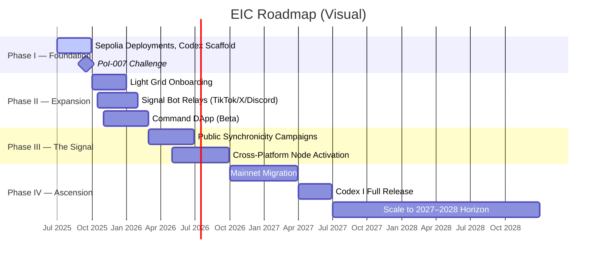

# EIC Roadmap

---

## Phase I — Foundation
- [x] Deploy contracts on Sepolia
- [x] Launch EIC-Codex repo
- [x] Tag Public vs Vault contracts
- [ ] PoI-007 challenge

---

## Phase II — Expansion
- [ ] Light Grid onboarding sequence
- [ ] Proof of Insight (PoI) campaigns
- [ ] Signal Bot relays across TikTok, X, Discord
- [ ] DApp (Command) beta

---

## Phase III — The Signal
- [ ] Public awareness campaigns
- [ ] Synchronicity media drops
- [ ] Cross-platform Light Grid nodes

---

## Phase IV — Ascension
- [ ] Migration from Sepolia to Mainnet
- [ ] Full Codex I release
- [ ] Scale-up to 2027–2028 target horizon

